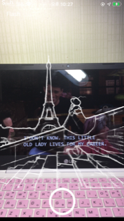

# Camera with HED filter

basic camera app with a filter made out of a picutre from your own photo album. 

## Getting Started

  

### Prerequisites

* Xcode 11

download converted HED model from this link and add it to the project that you've cloned. 
https://github.com/s1ddok/HED-CoreML/tree/master/HED-CoreML/Models


### Installing

You will need to just clone this project 

```
git clone https://github.com/eunchankang/ios_1.git
```
or go directly to your Xcode and click on clone existing project. 
and put https://github.com/eunchankang/ios_1.git

## Running the tests

Camera app only work in real devices, connect one and click on run on Xcode. 


## License

original work : https://github.com/s9xie/hed
original paper : https://arxiv.org/abs/1504.06375
ios implemented source : https://github.com/s1ddok/HED-CoreML


